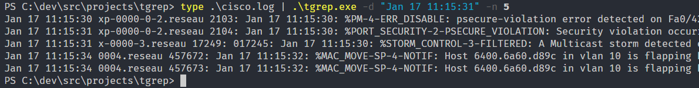

# tgrep

`tgrep` is a cli wich purpose is to find the n nearest syslog timestamped lines from stdin ( from tools like grep,awk, )

## Getting Started

`tgrep` is using standard flags from golang :

```
Usage of tgrep.exe
 -n int
        #lines to ouput (default 1)
  -t string
        approx time to look after (default "Jan 1 00:00:00")
  -v    prints current version
```



### Prerequisites

`tgrep` is written in golang, so building will requisite you to install golang.


### Installing

```
 go get github.com/thc2cat/tgrep
 go build 
 go install
```

## Contributing

Please read, fork and PR

## Authors

* **thc2cat** - *Initial work* 

## License (later)

This project is licensed under the whatever License - see the [LICENSE.md](LICENSE.md) file for details

## Acknowledgments

* Hat tip to anyone who's code was used
* Inspiration
* etc
